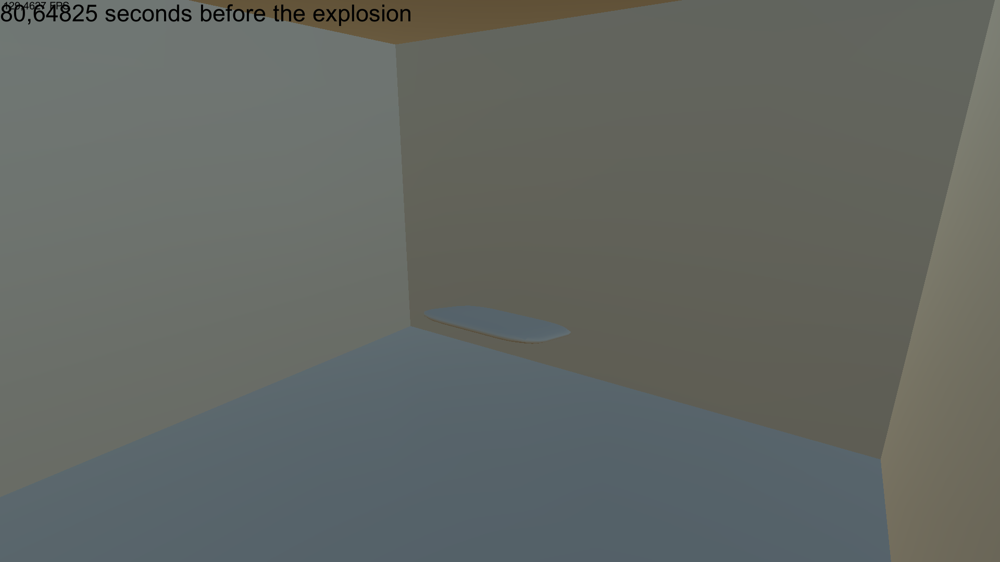
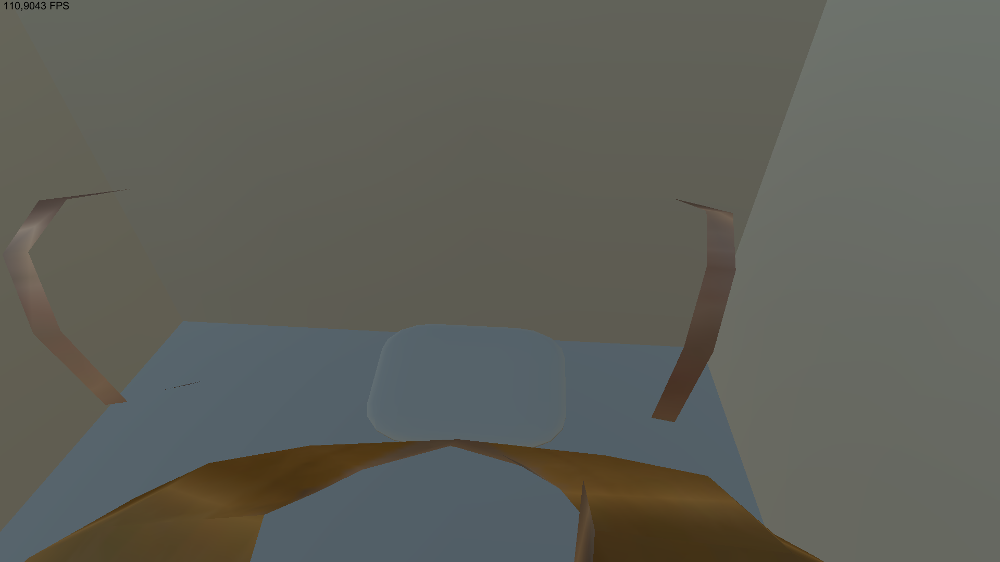
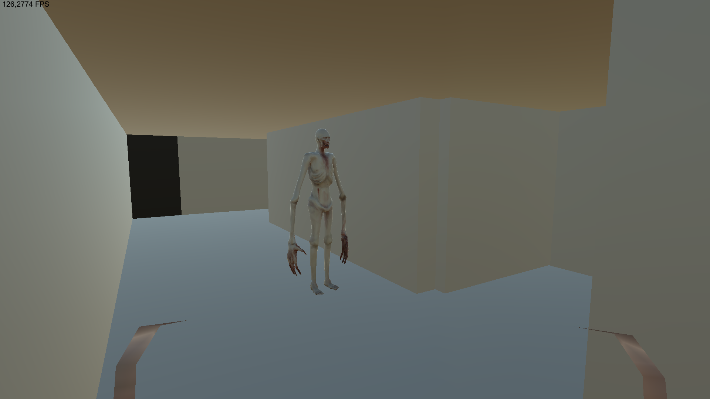
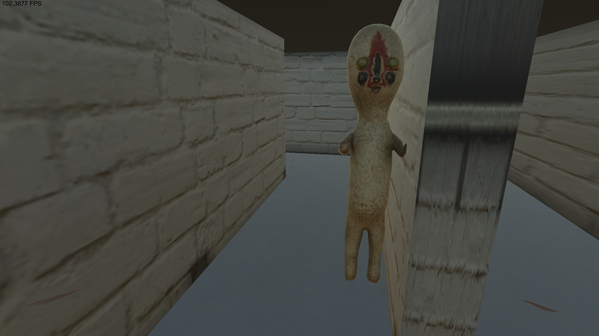

# SCP snaulX Edition
**SCP snaulX Edition** is a maze game about SCP ([http://scp-wiki.net/](http://scp-wiki.net/)). In it, you play as a [D-class](http://scp-wiki.net/security-clearance-levels#toc11) employee who was left alone in a complex with nothing with two monsters ([SCP-173](http://scp-wiki.net/scp-173) and [SCP-096](http://scp-wiki.net/scp-096)) (they currently have no abnormal abilities in the game). In order to get out of the complex, the player needs to find cards with which you can open the doors with a high level of access, blow up the complex, find the last card with which you can escape from the complex and escape from it. In this game, you can also completely close the SCP containment chamber.

Management is configured at startup (by default WASD or arrows). Doors open and cards are taken and buttons are pressed on E.

Fixes and changes with the OLD version (0.1.0):
*   SCP motion fixed
*   Partially fixed bug with door in SCP-173's containment chamber
*   Player speed independent of FPS
*   Detonation and explosion sounds of alpha warheads added
*   SCP deaths added during alpha warhead explosion
*   Now there is no NullReferenceException when a player dies  

0.1.1:
*   Now cards have their own color depending on the level:
    *   _yellow_- card of scientist
    *   _blue_- card of MTF
    *   _black_ - card of O5
*   Add main menu with two buttons:
    *   _New Game_- start new game
    *   _Exit_- exit from the game
*   Now during the game, when you click the button marked in Input / Cancel (marked in the start configuration) (usually this is Esc), the main menu appears

0.1.2:
*   Add level of difficulty (change in the main menu). It`s change speed and hp of player and scps and change kill points of scps:
    *   _Safe_ - easy
    *   _Euclid_ - normal
    *   _Keter_ - hard
*   Add sounds for buttons of lock&unlock doors of SCP contaiment zones
*  Also fix of bugs

_Second card - card of MTF. In order to enter a room with this card, you need to have a scientist card or catch luck when SCPs themselves open the door_

_Last card - card of O5. It can only be accessed with an MTF access level and detonating a warhead (at the top, as you can see its countdown)_

_The first card is the scientist’s card. You can enter with a zero level of tolerance_

_SCP-096 (On background exit gate)_

_SCP-173 (On background enter to containment zone of SCP-096)_  

**All info was take from [Documentation and Instruction for this Game](https://docs.google.com/document/d/18c7CPUubT0VBaM5hC2Ewlm473kigtDTfYbinHRcn7xk/edit?usp=sharing)**
